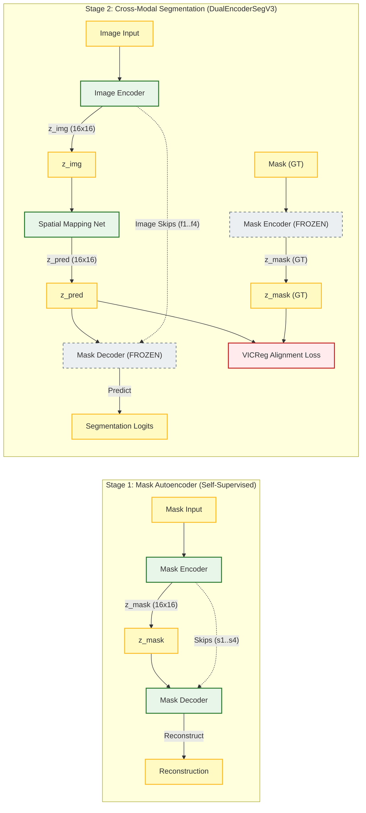

# DualEncoderSeg v3 — Architecture Design & Improvement Notes

The full implementation is at [dual_encoder_seg_v3.py](file:///F:/Anirban_250509/Projects/Dual%20Encoder/DualEncoderSeg/dual_encoder_seg_v3.py).

---

## What You Originally Wanted (& Why v2 Missed It)

> *Train from both sides. Prediction happens at the latent state. Fix the spatial information problem.*

v2's problems with these three goals:

| Goal                           | v2 Status | Root Cause                                                                                        |
| ------------------------------ | --------- | ------------------------------------------------------------------------------------------------- |
| Train from both sides          | Partial   | MaskEncoder trained in Stage 1, but its skip features were **discarded** — decoder never saw them |
| Predict at latent state        | Missing   | `z_pred` was only used for VICReg alignment, not for a pixel prediction head                      |
| Proper spatial info in decoder | Broken    | `MaskDecoder` had **zero skip connections** — decoded from 16×16 alone                            |

---

## v3 Architecture

### System Flow Diagram

```mermaid
flowchart LR
    %% Styling Definitions
    classDef stage1 fill:#e3f2fd,stroke:#1565c0,stroke-width:2px;
    classDef stage2 fill:#efebe9,stroke:#4e342e,stroke-width:2px;
    classDef tensor fill:#fff9c4,stroke:#fbc02d,stroke-width:2px;
    classDef model fill:#e8f5e9,stroke:#2e7d32,stroke-width:2px;
    classDef loss fill:#ffebee,stroke:#c62828,stroke-width:2px;
    classDef frozen fill:#eceff1,stroke:#37474f,stroke-width:1px,stroke-dasharray: 5 5;

    subgraph STAGE1["Stage 1: Mask Autoencoder (Self-Supervised)"]
        s1_in["Mask Input (512x512x1)"]:::tensor
        
        subgraph MaskEnc["MaskEncoder"]
            direction TB
            m_stem["Stem (32ch)"]
            m_d1["DownStage 1 (64ch)"]
            m_d2["DownStage 2 (128ch)"]
            m_d3["DownStage 3 (256ch)"]
            m_d4["DownStage 4 (256ch)"]
            m_d5["DownStage 5 (256ch)"]
            m_proj["Project (128ch)"]
            
            m_stem --> m_d1
            m_d1 --> m_d2
            m_d2 --> m_d3
            m_d3 --> m_d4
            m_d4 --> m_d5
            m_d5 --> m_proj
        end
        class MaskEnc model;
        
        s1_in --> m_stem
        
        z_mask["z_mask (16x16x128)"]:::tensor
        m_proj --> z_mask
        
        subgraph MaskDec["MaskDecoder"]
            direction TB
            md_exp["Expand (256ch)"]
            md_up1["Upsample + Conv (256ch)"]
            md_gate4["SkipFusionGate 4"]
            md_up2["Upsample + Conv (128ch)"]
            md_gate3["SkipFusionGate 3"]
            md_up3["Upsample + Conv (128ch)"]
            md_gate2["SkipFusionGate 2"]
            md_up4["Upsample + Conv (64ch)"]
            md_gate1["SkipFusionGate 1"]
            md_up5["Upsample + Conv (32ch)"]
            md_out["Out Conv (1ch)"]
            
            md_exp --> md_up1
            md_up1 --> md_gate4
            md_gate4 --> md_up2
            md_up2 --> md_gate3
            md_gate3 --> md_up3
            md_up3 --> md_gate2
            md_gate2 --> md_up4
            md_up4 --> md_gate1
            md_gate1 --> md_up5
            md_up5 --> md_out
        end
        class MaskDec model;
        
        z_mask --> md_exp
        
        %% Skips for Stage 1
        m_d1 -. "s1 skip" .-> md_gate1
        m_d2 -. "s2 skip" .-> md_gate2
        m_d3 -. "s3 skip" .-> md_gate3
        m_d4 -. "s4 skip" .-> md_gate4
        
        s1_recon["Recon Logits (512x512x1)"]:::tensor
        md_out --> s1_recon
        
        s1_loss["Loss: Tversky + Boundary"]:::loss
        s1_recon --> s1_loss
        s1_in --> s1_loss
    end

    subgraph STAGE2["Stage 2: Cross-Modal Training (DualEncoderSegV3)"]
        s2_img_in["Image Input (512x512x3)"]:::tensor
        s2_mask_in["Mask Input (GT) (512x512x1)"]:::tensor
        
        subgraph ImageEnc["ImageEncoder"]
            direction TB
            i_stem["Stem (64ch)"]
            i_d1["DownStage 1 (64ch)"]
            i_d2["DownStage 2 (128ch)"]
            i_d3["DownStage 3 (256ch)"]
            i_d4["DownStage 4 (256ch)"]
            i_d5["DownStage 5 (256ch)"]
            i_proj["Project (128ch)"]
            
            i_stem --> i_d1
            i_d1 --> i_d2
            i_d2 --> i_d3
            i_d3 --> i_d4
            i_d4 --> i_d5
            i_d5 --> i_proj
        end
        class ImageEnc model;
        
        s2_img_in --> i_stem
        
        z_img["z_img (16x16x128)"]:::tensor
        i_proj --> z_img
        
        subgraph MapNet["SpatialMappingNet"]
            direction TB
            m_mlp["1x1 Conv (MLP) (256ch)"]
            m_dw["3x3 Depthwise Conv (256ch)"]
            m_pw["1x1 Pointwise Conv (256ch)"]
            m_back["1x1 Conv (128ch)"]
            m_res["Residual Conv (128ch)"]
            
            m_mlp --> m_dw
            m_dw --> m_pw
            m_pw --> m_back
        end
        class MapNet model;
        
        z_img --> m_mlp
        z_img --> m_res
        
        z_pred["z_pred (16x16x128)"]:::tensor
        m_back --> z_pred
        m_res --> z_pred
        
        subgraph AuxPrediction["AuxHead (Training Only)"]
            direction TB
            aux_up["Upsample 2x"]
            aux_c1["Conv 3x3 (64ch)"]
            aux_c2["Conv 3x3 (32ch)"]
            aux_out["Conv 1x1 (1ch)"]
            
            aux_up --> aux_c1
            aux_c1 --> aux_c2
            aux_c2 --> aux_out
        end
        class AuxPrediction model;
        
        z_pred --> aux_up
        aux_logits["aux_logits (32x32x1)"]:::tensor
        aux_out --> aux_logits
        
        %% Reused and Frozen Mask Encoder/Decoder
        subgraph MaskEncFrozen["MaskEncoder (FROZEN)"]
            direction TB
            mef_stem["Stem"]
            mef_down["Down Stages"]
            mef_proj["Project (128ch)"]
            
            mef_stem --> mef_down
            mef_down --> mef_proj
        end
        class MaskEncFrozen frozen;
        
        s2_mask_in --> mef_stem
        z_mask_gt["z_mask (GT) (16x16x128)"]:::tensor
        mef_proj --> z_mask_gt
        
        subgraph MaskDecFrozen["MaskDecoder (FROZEN)"]
            direction TB
            mdf_exp["Expand (256ch)"]
            mdf_up1["Upsample + Conv (256ch)"]
            mdf_gate4["SkipFusionGate 4"]
            mdf_up2["Upsample + Conv (128ch)"]
            mdf_gate3["SkipFusionGate 3"]
            mdf_up3["Upsample + Conv (128ch)"]
            mdf_gate2["SkipFusionGate 2"]
            mdf_up4["Upsample + Conv (64ch)"]
            mdf_gate1["SkipFusionGate 1"]
            mdf_up5["Upsample + Conv (32ch)"]
            mdf_out["Out Conv (1ch)"]
            
            mdf_exp --> mdf_up1
            mdf_up1 --> mdf_gate4
            mdf_gate4 --> mdf_up2
            mdf_up2 --> mdf_gate3
            mdf_gate3 --> mdf_up3
            mdf_up3 --> mdf_gate2
            mdf_gate2 --> mdf_up4
            mdf_up4 --> mdf_gate1
            mdf_gate1 --> mdf_up5
            mdf_up5 --> mdf_out
        end
        class MaskDecFrozen frozen;
        
        z_pred --> mdf_exp
        
        %% Skips for Stage 2 (Image Skips to Mask Decoder)
        i_d1 -. "f1 skip" .-> mdf_gate1
        i_d2 -. "f2 skip" .-> mdf_gate2
        i_d3 -. "f3 skip" .-> mdf_gate3
        i_d4 -. "f4 skip" .-> mdf_gate4
        
        s2_pred_logits["pred_logits (512x512x1)"]:::tensor
        mdf_out --> s2_pred_logits
        
        %% Losses
        vicreg_loss["VICReg Loss (sim, var, cov)"]:::loss
        z_pred --> vicreg_loss
        z_mask_gt --> vicreg_loss
        
        seg_loss["Segmentation Loss: Tversky + Boundary"]:::loss
        s2_pred_logits --> seg_loss
        s2_mask_in --> seg_loss
        
        aux_loss["Aux Loss: BCE"]:::loss
        aux_logits --> aux_loss
        s2_mask_in --> aux_loss
    end
```



### Simplified Top-Level Flow Diagram




### Detailed Layer Breakdown

```
STAGE 1 — Mask Autoencoder (self-supervised, skip-aware)
─────────────────────────────────────────────────────────────────────
mask 512x512
  └─► MaskEncoder
        stem   → 512x512x32
        down1  → 256x256x64   ──────────────────────────────► s1
        down2  → 128x128x128  ────────────────────────────► s2
        down3  → 64x64x256    ──────────────────────────► s3
        down4  → 32x32x256    ────────────────────────► s4
        down5  → 16x16x256
        project→ 16x16x128   (z_mask — the latent)

  └─► MaskDecoder  (receives [s1,s2,s3,s4] from above)
        expand → 16x16x256
        up1    → 32x32x256
        gate4 ◄──── s4 (32x32x256)   ← learned gated fusion
        up2    → 64x64x128
        gate3 ◄──── s3 (64x64x256)
        up3    → 128x128x128
        gate2 ◄──── s2 (128x128x128)
        up4    → 256x256x64
        gate1 ◄──── s1 (256x256x64)
        up5    → 512x512x32
        out    → 512x512x1   (recon logits)

STAGE 2 — Cross-Modal Skip Injection (the key new idea)
─────────────────────────────────────────────────────────────────────
image 512x512
  └─► ImageEncoder  (same depth as MaskEncoder)
        stem   → 512x512x64
        down1  → 256x256x64   ──────────────────────────────► f1
        down2  → 128x128x128  ────────────────────────────► f2
        down3  → 64x64x256    ──────────────────────────► f3
        down4  → 32x32x256    ────────────────────────► f4
        down5  → 16x16x256
        project→ 16x16x128   (z_img)

  └─► MappingNet  (image latent → mask latent space)
        z_img → z_pred (16x16x128)

  └─► AuxHead  [PREDICTION AT LATENT STATE]
        z_pred → 32x32x1   (aux_logits for short-path gradient)

  └─► MaskDecoder (frozen decoder from Stage 1, receives IMAGE skips)
        expand → 16x16x256
        up1    → 32x32x256
        gate4 ◄──── f4 (32x32x256)   ← IMAGE features here!
        up2    → 64x64x128
        gate3 ◄──── f3 (64x64x256)   ← IMAGE features here!
        up3    → 128x128x128
        gate2 ◄──── f2 (128x128x128) ← IMAGE features here!
        up4    → 256x256x64
        gate1 ◄──── f1 (256x256x64)  ← IMAGE features here!
        up5    → 512x512x32
        out    → 512x512x1   (pred_logits)

mask (GT)
  └─► MaskEncoder (FROZEN)
        → z_mask (16x16x128)  used only for VICReg alignment loss
```

---

## The Skip Connection Fix — `SkipFusionGate`

**v2 problem**: decoder had no skip connections at all.

**Naive fix** (concat or add): Would work in Stage 1 but **break in Stage 2** because image features and mask decoder features are in different representational spaces.

**v3 solution — Learned Gated Fusion**:

```python
gate  = sigmoid( W_gate * cat(skip, ctx) )   # per-channel confidence
out   = ctx_proj(ctx) + gate * skip_proj(skip)
```

- `ctx` = decoder's upsampled latent context
- `skip` = encoder feature at the same resolution
- The gate learns **how much to trust the skip** at each channel
- In Stage 1: mask skip and decoder context are aligned → gate learns to open wide
- In Stage 2: image skip and mask decoder are cross-domain → gate learns to selectively use image texture

This is why the decoder can be **reused without retraining** in Stage 2 — the gate adapts automatically.

---

## Prediction at the Latent State — `AuxHead`

This was your original design intent: the mapped latent `z_pred` IS the predicted mask representation. We add a lightweight head that converts it to pixel probabilities at 32×32:

```
z_pred (16×16×128) → upsample → Conv3×3 → Conv3×3 → Conv1×1 → aux_logits (32×32×1)
```

**Why this matters for training**:
- Without aux head: gradient must flow `loss → 5 up-stages → MappingNet → ImageEncoder` — very long path, vanishing gradients
- With aux head: direct path `aux_loss → MappingNet → ImageEncoder` — stable early training

**At inference**: AuxHead is NOT called. Zero overhead.

---

## VICReg Fix

|                          | v2 (broken)                                                      | v3 (fixed)                                          |
| ------------------------ | ---------------------------------------------------------------- | --------------------------------------------------- |
| Input shape              | `(B, C, H, W)` reshaped to `(B*H*W, C)`                          | `(B, C, H, W)` — spatial preserved                  |
| Variance computed over   | `B*H*W` dimension (spatially mixed)                              | `B` dimension per spatial position                  |
| Covariance computed over | `B*H*W` (all positions collapsed)                                | `B` per position, averaged over `H,W`               |
| Spatial assumption       | All 256 spatial positions should share same distribution (wrong) | Each position can have its own statistics (correct) |

---

## Loss Weight Fix

| Term        | v2 weight                          | v3 weight              | Reason                                            |
| ----------- | ---------------------------------- | ---------------------- | ------------------------------------------------- |
| VICReg sim  | 25.0                               | 5.0                    | Was dominating pixel losses completely            |
| VICReg var  | 25.0                               | 5.0                    | Same — made total loss ~1000× larger than Tversky |
| Tversky     | 1.5                                | 1.5                    | Unchanged                                         |
| Boundary    | 1.0                                | 1.0                    | Unchanged                                         |
| Aux loss fn | Tversky on nearest-neighbor target | BCE on bilinear target | Nearest-neighbor destroyed thin vessels at 32×32  |

---

## Quick Start

```python
from dual_encoder_seg_v3 import *
from pathlib import Path
from torch.utils.data import DataLoader

# Data
base = Path("/kaggle/input/.../Data/train")
imgs  = sorted((base / "image").glob("*.png"))
masks = sorted((base / "mask").glob("*.png"))
split = int(0.8 * len(imgs))

train_dl = DataLoader(RetinaDataset(imgs[:split],  masks[:split],  augment=True),  batch_size=4, shuffle=True,  num_workers=2)
val_dl   = DataLoader(RetinaDataset(imgs[split:],  masks[split:],  augment=False), batch_size=4, shuffle=False, num_workers=2)

# Train
cfg   = Config()
model = full_pipeline(train_dl, val_dl, cfg=cfg, device='cuda')
```
