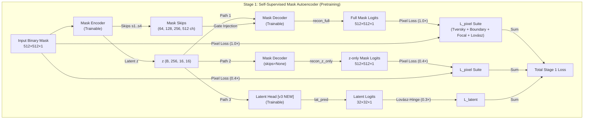
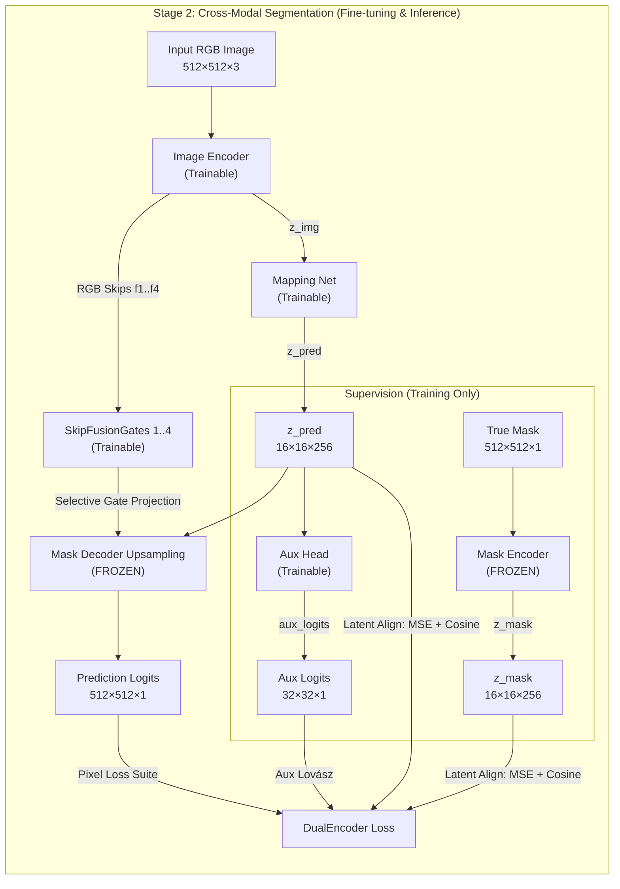
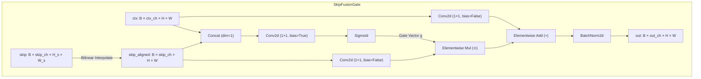

# DualEncoderSeg v3: Architectural Overview

This document provides a comprehensive, three-level architectural overview of the **DualEncoderSeg v3** model compared to the **UNet Baseline**, as implemented in [dual_encoder_v3.ipynb](file:///mnt/l/Research/Notebooks/DualEncoder/Dual-Encoder/DualEncoderSeg/dual_encoder_v3.ipynb).

---

## 1. Architectural Paradigms (Level 1)

DualEncoderSeg v3 is trained using a **two-stage training protocol**, separating structural shape priors from cross-modal image-to-mask mapping.

### Stage 1: Self-Supervised Dual-Path Mask Autoencoder (Pretraining)
In Stage 1, the [MaskAutoencoder](file:///mnt/l/Research/Notebooks/DualEncoder/Dual-Encoder/DualEncoderSeg/dual_encoder_v3.ipynb#L539-L602) learns dense binary vessel representations by sharing a single encoder pass across **three parallel paths**:
1. **Path 1 (Main)**: Decodes from the latent bottleneck $z$ using binary mask skip connections to reconstruct the full mask.
2. **Path 2 ($z$-only)**: Decodes from the latent $z$ alone (skips disabled) to force the latent space to represent full shape context.
3. **Path 3 (Latent)**: Directly supervises $z$ at $32 \times 32$ using a [LatentHead](file:///mnt/l/Research/Notebooks/DualEncoder/Dual-Encoder/DualEncoderSeg/dual_encoder_v3.ipynb#L503-L536) to solve a low-resolution segmentation task.

---

### Stage 2: Dual Encoder Gated Skip-Injection & Latent Alignment
In Stage 2, the [MaskEncoder](file:///mnt/l/Research/Notebooks/DualEncoder/Dual-Encoder/DualEncoderSeg/dual_encoder_v3.ipynb#L332-L369) and [MaskDecoder](file:///mnt/l/Research/Notebooks/DualEncoder/Dual-Encoder/DualEncoderSeg/dual_encoder_v3.ipynb#L437-L482) upsampling weights are **frozen**, while the [SkipFusionGates](file:///mnt/l/Research/Notebooks/DualEncoder/Dual-Encoder/DualEncoderSeg/dual_encoder_v3.ipynb#L257-L291) are **unfrozen and trainable** to adapt to the cross-modal domain shift. An [ImageEncoder](file:///mnt/l/Research/Notebooks/DualEncoder/Dual-Encoder/DualEncoderSeg/dual_encoder_v3.ipynb#L372-L405) extracts RGB features and skips, mapping the image representation to the mask latent space via a [SpatialMappingNet](file:///mnt/l/Research/Notebooks/DualEncoder/Dual-Encoder/DualEncoderSeg/dual_encoder_v3.ipynb#L523-L551). Trainable [AuxHead](file:///mnt/l/Research/Notebooks/DualEncoder/Dual-Encoder/DualEncoderSeg/dual_encoder_v3.ipynb#L594-L614) provides a short gradient path to the mapping network.

---

## 2. Component Pipeline & Tensor Shapes (Level 2)

This diagram details the tensor shapes, spatial dimensions, and channel counts flowing through all major sub-modules during **Stage 2 training**.

```mermaid
graph LR
    %% Inputs
    I["Image (B, 3, 512, 512)"]
    M["Mask (B, 1, 512, 512)"]

    %% Image Encoder
    subgraph ImageEncoder["ImageEncoder (Trainable)"]
        I_stem["Stem (DoubleConv)"] -->|"64ch | 512×512"| I_d1["DownBlock 1"]
        I_d1 -->|"64ch | 256×256"| I_d2["DownBlock 2"]
        I_d2 -->|"128ch | 128×128"| I_d3["DownBlock 3"]
        I_d3 -->|"256ch | 64×64"| I_d4["DownBlock 4"]
        I_d4 -->|"512ch | 32×32"| I_d5["DownBlock 5"]
        I_d5 -->|"512ch | 16×16"| I_proj["Dropout2d + Conv1×1"]
    end
    
    %% Skips
    I_d1 -->|"f1 | 64ch | 256×256"| G1["SkipFusionGate 1 (Trainable)"]
    I_d2 -->|"f2 | 128ch | 128×128"| G2["SkipFusionGate 2 (Trainable)"]
    I_d3 -->|"f3 | 256ch | 64×64"| G3["SkipFusionGate 3 (Trainable)"]
    I_d4 -->|"f4 | 512ch | 32×32"| G4["SkipFusionGate 4 (Trainable)"]

    %% Latent Mapping
    I_proj -->|"z_img (B, 256, 16, 16)"| SMN["SpatialMappingNet (Trainable)"]
    SMN -->|"z_pred (B, 256, 16, 16)"| ZP["z_pred (B, 256, 16, 16)"]

    %% Mask Decoder
    subgraph MaskDecoder["MaskDecoder (Upsampling FROZEN, Gates Trainable)"]
        EXP["Expand Conv"] -->|"512ch | 16×16"| U1["UpBlock 1"]
        U1 -->|"512ch | 32×32"| G4
        G4 -->|"512ch | 32×32"| U2["UpBlock 2"]
        U2 -->|"256ch | 64×64"| G3
        G3 -->|"256ch | 64×64"| U3["UpBlock 3"]
        U3 -->|"128ch | 128×128"| G2
        G2 -->|"128ch | 128×128"| U4["UpBlock 4"]
        U4 -->|"64ch | 256×256"| G1
        G1 -->|"64ch | 256×256"| U5["UpBlock 5"]
        U5 -->|"32ch | 512×512"| OUT_CONV["Conv1×1"]
    end
    
    ZP --> EXP
    OUT_CONV -->|"Logits (B, 1, 512, 512)"| PL["Pixel Loss Suite (Trainable)"]
    
    %% Mask Encoder
    subgraph MaskEncoder["MaskEncoder (FROZEN)"]
        M --> M_stem["Stem (DoubleConv)"] --> M_d1["Down 1"] --> M_d2["Down 2"] --> M_d3["Down 3"] --> M_d4["Down 4"] --> M_d5["Down 5"] --> M_proj["Proj"]
    end
    
    M_proj -->|"z_mask (B, 256, 16, 16)"| ZM["z_mask (B, 256, 16, 16)"]
    ZP & ZM -->|"MSE + Cosine Distance"| AL["Latent Alignment Loss (Trainable)"]
    
    %% Aux Head
    ZP --> AUX["Aux Head (Trainable)"]
    AUX -->|"Aux Logits (B, 1, 32, 32)"| AUX_LOSS["Aux Lovász Loss (Trainable)"]
```

---

## 3. Micro-Architecture Details (Level 3)

This section maps out the exact layer progressions and operations inside the primitives.

### Block Primitives

```mermaid
graph TD
    subgraph DoubleConv["DoubleConv (Atomic Conv Block)"]
        DC_in([Input Tensor]) --> DC_c1["Conv3×3 (bias=False)"]
        DC_c1 --> DC_b1["BatchNorm2d"]
        DC_b1 --> DC_r1["ReLU"]
        DC_r1 --> DC_c2["Conv3×3 (bias=False)"]
        DC_c2 --> DC_b2["BatchNorm2d"]
        DC_b2 --> DC_r2["ReLU"]
        DC_r2 --> DC_out([Output Tensor])
    end
    
    subgraph DownBlock["DownBlock (Encoder Stage)"]
        DB_in([Input Tensor]) --> DB_pool["MaxPool2d (2×2)"]
        DB_pool --> DB_dc["DoubleConv"]
        DB_dc --> DB_out([Output Tensor])
    end
    
    subgraph UpBlock["UpBlock (Decoder Stage)"]
        UB_in([Input Tensor]) --> UB_up["Upsample (Bilinear, 2×)"]
        UB_up --> UB_dc["DoubleConv"]
        UB_dc --> UB_out([Output Tensor])
    end
```

---

### SkipFusionGate Gating Mechanism
A learned channel-wise gate dynamically controls how much RGB image skip information is integrated into the frozen mask-trained decoder.
$$\mathbf{g} = \sigma(\mathbf{W} \cdot [\mathbf{x}_{\text{skip}}, \mathbf{x}_{\text{ctx}}])$$
$$\mathbf{x}_{\text{out}} = \text{BN}(\text{proj}_{\text{ctx}}(\mathbf{x}_{\text{ctx}}) + \mathbf{g} \odot \text{proj}_{\text{skip}}(\mathbf{x}_{\text{skip}}))$$

---

### Latent Space Bridge (Mapping Bridge Options)
The latent bridge maps the Image representation into the Mask representation space.
1. **Option 1: Spatial Conv Bridge ([SpatialMappingNet](file:///mnt/l/Research/Notebooks/DualEncoder/Dual-Encoder/DualEncoderSeg/dual_encoder_v3.ipynb#L523-L551))** - Preserves local spatial alignment using a depthwise-separable bottleneck with a residual shortcut. Highly parameter-efficient. (Recommended / Default).
2. **Option 2: True Flattened Latent DNN ([GlobalLatentDNN](file:///mnt/l/Research/Notebooks/DualEncoder/Dual-Encoder/DualEncoderSeg/dual_encoder_v3.ipynb#L556-L592))** - Flattens the $16 \times 16$ grid to allow global coordinate communication through deep dense layers.

#### Option 1: SpatialMappingNet (Local Conv Bridge)

```mermaid
graph TD
    subgraph SMN["SpatialMappingNet"]
        SMN_in["z_img: B, 256, 16, 16"] --> SMN_expand["Conv1×1 (256→512, bias=False)"]
        SMN_expand --> SMN_bn1["BatchNorm2d"]
        SMN_bn1 --> SMN_a1["GELU"]
        
        SMN_a1 --> SMN_dw["Depthwise Conv3×3 (groups=512, padding=1, bias=False)"]
        SMN_dw --> SMN_pw["Pointwise Conv1×1 (512→512, bias=False)"]
        
        SMN_pw --> SMN_bn2["BatchNorm2d"]
        SMN_bn2 --> SMN_a2["GELU"]
        SMN_a2 --> SMN_drop["Dropout2d (p=0.1)"]
        SMN_drop --> SMN_proj["Conv1×1 (512→256, bias=False)"]
        SMN_proj --> SMN_bn3["BatchNorm2d"]
        
        SMN_in --> SMN_res["Conv1×1 (256→256, bias=False)"]
        
        SMN_bn3 --> SMN_add["Add (+)"]
        SMN_res --> SMN_add
        
        SMN_add --> SMN_out["z_pred: B, 256, 16, 16"]
    end
```

#### Option 2: GlobalLatentDNN (Global MLP Bridge)

```mermaid
graph TD
    subgraph GDNN["GlobalLatentDNN"]
        GDNN_in["x: B, 256, 16, 16"] --> GDNN_flat["Flatten (x.view)"]
        GDNN_flat -->|"B, 65536"| GDNN_l1["Linear (65536→1024)"]
        GDNN_l1 --> GDNN_ln1["LayerNorm"]
        GDNN_ln1 --> GDNN_a1["GELU"]
        GDNN_a1 --> GDNN_d1["Dropout (p=0.1)"]
        
        GDNN_d1 --> GDNN_l2["Linear (1024→1024)"]
        GDNN_l2 --> GDNN_ln2["LayerNorm"]
        GDNN_ln2 --> GDNN_a2["GELU"]
        GDNN_a2 --> GDNN_d2["Dropout (p=0.1)"]
        
        GDNN_d2 --> GDNN_l3["Linear (1024→65536)"]
        GDNN_l3 --> GDNN_ln3["LayerNorm"]
        
        GDNN_in --> GDNN_add["Add (+)"]
        GDNN_ln3 -->|"Reshape back (B, 256, 16, 16)"| GDNN_add
        GDNN_add --> GDNN_out["z_pred: B, 256, 16, 16"]
    end
```

---

### Latent Supervision Heads
These heads prediction maps at 32×32 resolution directly from latent variables during training.
- **LatentHead**: Used in Stage 1 to supervise $z$ directly from the MaskEncoder.
- **AuxHead**: Used in Stage 2 to supervise $z_{\text{pred}}$ from the SpatialMappingNet.

Both share the identical micro-architecture:

```mermaid
graph TD
    subgraph LatentSupervision["Latent Supervision Head (LatentHead / AuxHead)"]
        LH_in["z: B, 256, 16, 16"] --> LH_up["Upsample (Bilinear, 2x)"]
        LH_up -->|"B, 256, 32, 32"| LH_c1["Conv3×3 (256→64, bias=False)"]
        LH_c1 --> LH_bn1["BatchNorm2d"]
        LH_bn1 --> LH_g1["GELU"]
        LH_g1 -->|"B, 64, 32, 32"| LH_c2["Conv3×3 (64→32, bias=False)"]
        LH_c2 --> LH_bn2["BatchNorm2d"]
        LH_bn2 --> LH_r1["ReLU"]
        LH_r1 -->|"B, 32, 32, 32"| LH_c3["Conv1×1 (32→1, bias=True)"]
        LH_c3 --> LH_out["logits: B, 1, 32, 32"]
    end
```

---

## 4. Controlled Variables & Comparison Matrix

To ensure a fair comparison during evaluation, components are aligned as follows:

| Feature / Parameter | DualEncoderSeg v3 (Default) | UNet Baseline | Alignment Logic |
|---|---|---|---|
| **Image Resolution** | $512 \times 512$ | $512 \times 512$ | Identical receptive fields |
| **Conv Block** | `DoubleConv` (no attention) | `DoubleConv` | Eliminates block-level bias |
| **Downsampling** | `MaxPool2d` (2×2) | `MaxPool2d` (2×2) | Identical spatial collapse dynamics |
| **Channel Progression** | $64 \rightarrow 128 \rightarrow 256 \rightarrow 512 \rightarrow 512$ | $64 \rightarrow 128 \rightarrow 256 \rightarrow 512 \rightarrow 512$ | Controlled layer capacity |
| **Latent Dimension** | $16 \times 16 \times 256$ | $16 \times 16 \times 512$ | DualEncoder projects to tighter bottleneck |
| **Mapping Bridge** | `SpatialMappingNet` (Trainable) | None | Mapped bridge testing vs unmapped bottleneck |
| **Skip Connections** | Gated (`SkipFusionGate` - Trainable) | Concatenation + DoubleConv | Gating mechanism efficacy evaluation |
| **Parameter Budget** | **11,771,105** (trainable) / **28,587,726** (total) | **13,326,689** (total/trainable) | Pre-freeze vs Post-freeze comparison |

### Detailed Parameter Count Breakdown (v3)

| Module | DualEncoderSeg v3 (Params) | UNet Baseline (Params) | Trainable Status in Stage 2 |
| :--- | :---: | :---: | :---: |
| **Image Encoder** | 9,613,504 | — | **Trainable** |
| **Mask Encoder** | 9,612,352 | — | **FROZEN** |
| **Mask Decoder (all)** | 8,599,789 | — | Gated adaptation |
| &nbsp;&nbsp;&nbsp;&nbsp;├─ *Upsampling weights* | *7,204,269* | — | **FROZEN** |
| &nbsp;&nbsp;&nbsp;&nbsp;└─ *SkipFusionGates ×4* | *1,395,520* | — | **Trainable** |
| **MappingNet (Spatial)** | 595,968 | — | **Trainable** |
| **AuxHead (Stage 2)** | 166,113 | — | **Trainable** |
| **LatentHead (Stage 1 only)** | 166,113 | — | **FROZEN** (Not called) |
| **UNet Encoder** | — | 9,407,936 | **Trainable** |
| **UNet Decoder** | — | 3,918,753 | **Trainable** |
| **Total Deployment (Inference)** | **18,809,261** | **13,326,689** | Deployable weights |
| **Total Active Training (Stage 2)** | **28,587,726** | **13,326,689** | Memory footprint |
| **Total Trainable (Stage 2)** | **11,771,105** | **13,326,689** | Optimization space |

---

## 5. Loss Suite & Training Protocol

### Stage 1: Dual-Path Mask Autoencoder Loss
In Stage 1, the training loss optimizes three components in parallel to encourage both high-fidelity skip-fused reconstruction and high-content bottleneck encodings:
$$\mathcal{L}_{\text{Stage1}} = \mathcal{L}_{\text{main}} + \lambda_{z} \mathcal{L}_{z\_only} + \lambda_{\text{lat}} \mathcal{L}_{\text{lat\_head}}$$

- **Main Reconstruction Loss ($\mathcal{L}_{\text{main}}$)**: [PixelLoss](file:///mnt/l/Research/Notebooks/DualEncoder/Dual-Encoder/DualEncoderSeg/dual_encoder_v3.ipynb#L974-L1002) evaluated on full skip-injected outputs ($1.0 \times$).
- **$z$-only Reconstruction Loss ($\mathcal{L}_{z\_only}$)**: [PixelLoss](file:///mnt/l/Research/Notebooks/DualEncoder/Dual-Encoder/DualEncoderSeg/dual_encoder_v3.ipynb#L974-L1002) evaluated on decoder outputs generated from $z$ alone, with skips disabled ($\lambda_z = 0.4$).
- **Latent Supervision Loss ($\mathcal{L}_{\text{lat\_head}}$)**: Lovász Hinge loss evaluated at $32 \times 32$ pixels on the outputs of the latent supervision head ($\lambda_{\text{lat}} = 0.3$).

---

### Stage 2: Cross-Modal Alignment & Segmentation Loss
In Stage 2, the total objective is formulated as:
$$\mathcal{L}_{\text{Stage2}} = \mathcal{L}_{\text{pixel}} + \lambda_{\text{align}}(t) \mathcal{L}_{\text{align}}(\mathbf{z}_{\text{pred}}, \mathbf{z}_{\text{mask}}) + \lambda_{\text{aux}}\mathcal{L}_{\text{Lov\acute{a}sz-Aux}}$$

- **Combined Pixel Loss ($\mathcal{L}_{\text{pixel}}$)**: Applied identically to the main output logits.
  $$\mathcal{L}_{\text{pixel}} = 1.5 \mathcal{L}_{\text{Tversky}} + 1.0 \mathcal{L}_{\text{Boundary}} + 0.5 \mathcal{L}_{\text{Focal}} + 1.0 \mathcal{L}_{\text{Lov\acute{a}sz}}$$
  - **Tversky ($\alpha=0.3, \beta=0.7$)**: Focuses on vessel recall by penalizing false negatives higher.
  - **Boundary**: Sobel-weighted binary cross-entropy, applying $5 \times$ penalty at vessel boundaries.
  - **Focal ($\gamma=2.0, \alpha=0.25$)**: Down-weights easy background, focusing on hard/ambiguous pixels.
  - **Lovász**: Smooth mathematical surrogate directly optimizing intersection-over-union.
- **Latent Alignment Loss ($\mathcal{L}_{\text{align}}$)**: Aligns predicted latent $z_{\text{pred}}$ with frozen target $z_{\text{mask}}$:
  $$\mathcal{L}_{\text{align}} = \text{MSE}(\mathbf{z}_{\text{pred}}, \mathbf{z}_{\text{mask}}) + \left(1 - \text{CosineSimilarity}(\mathbf{z}_{\text{pred}}, \mathbf{z}_{\text{mask}})\right)$$
- **Alignment Weight Curriculum ($\lambda_{\text{align}}(t)$)**:
  - **Epochs 1–20**: $1.0$ (Forces coarse structural alignment).
  - **Epochs 21–60**: $0.5$ (Transitions control to segmentor).
  - **Epochs 61+**: $0.2$ (Anchors representation while optimizing fine boundary metrics).
- **Auxiliary Supervision ($\mathcal{L}_{\text{Lov\acute{a}sz-Aux}}$)**: Lovász Hinge loss evaluated at $32 \times 32$ pixels on [AuxHead](file:///mnt/l/Research/Notebooks/DualEncoder/Dual-Encoder/DualEncoderSeg/dual_encoder_v3.ipynb#L594-L614) outputs ($\lambda_{\text{aux}} = 0.4$) to supply short, strong gradient paths directly to the bridge.

---

### VICReg Loss Formulation (Stage 2)
To stabilize the latent representation space, a batched VICReg formulation is applied without spatial collapse, ensuring each spatial coordinate preserves its individual representation statistics:
1. **Invariance**: MSE similarity between predicted $z_{\text{pred}}$ and target $z_{\text{mask}}$:
   $$\mathcal{S} = \text{MSE}(\mathbf{z}_{\text{pred}}, \mathbf{z}_{\text{mask}})$$
2. **Variance**: Forces channel variance across the batch dimension to exceed the margin $\gamma_{\text{var}} = 1$:
   $$\mathcal{V} = \frac{1}{d} \sum_{j=1}^{d} \max\left(0, 1 - \sqrt{\text{Var}(\mathbf{z}_{\cdot, j}) + \epsilon}\right)$$
3. **Covariance**: Drives off-diagonal elements of the covariance matrix towards $0$ to decorrelate features:
   $$\mathcal{C} = \frac{1}{d} \sum_{i \neq j} \left(\text{Cov}(\mathbf{z}_{\cdot, i}, \mathbf{z}_{\cdot, j})\right)^2$$
