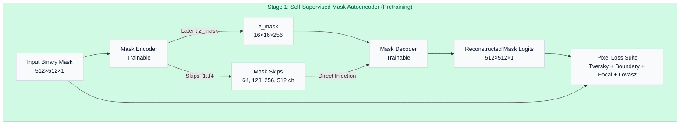
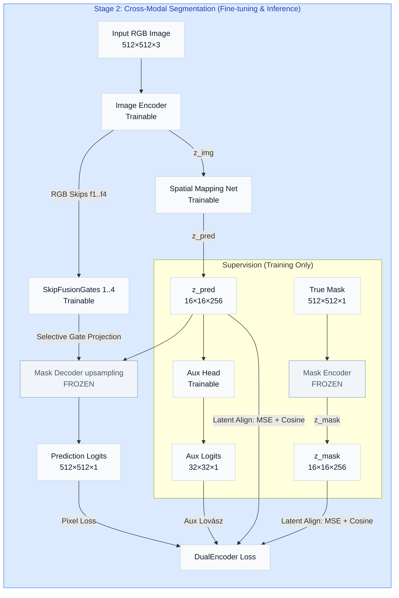
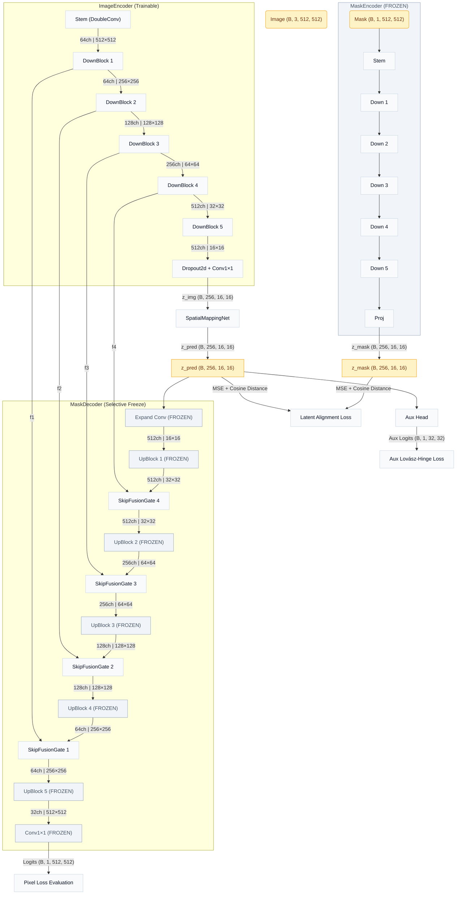
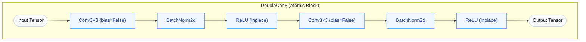
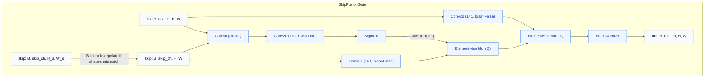

# DualEncoderSeg v2: Architectural Overview

This document provides a comprehensive, three-level architectural overview of the **DualEncoderSeg v2** model compared to the **UNet Baseline**, as implemented in [dual_encoder_v2.ipynb](file:///F:/Anirban_250509/Projects/Dual%20Encoder/DualEncoderSeg/dual_encoder_v2.ipynb).

---

## 1. Architectural Paradigms (Level 1)

DualEncoderSeg v2 is trained using a **two-stage training protocol**, separating structural shape priors from cross-modal image-to-mask mapping.

### Stage 1: Mask Autoencoder Pretraining (Self-Supervision)
In Stage 1, the model learns a dense representation of binary vessel shapes. The encoder compresses the mask into a latent space, and the decoder reconstructs it using native mask skip connections.

### Stage 2: Dual Encoder Training & Inference
In Stage 2, the Mask Encoder and Mask Decoder (upsampling layers) are frozen. An Image Encoder processes the RGB image, maps it into the mask latent space via a Spatial Mapping Network, and decodes it. Gates are unfrozen to selectively translate RGB features into the mask domain.

---

## 2. Component Pipeline & Tensor Shapes (Level 2)

This diagram details the tensor shapes, spatial dimensions, and channel counts flowing through all major sub-modules during Stage 2 training.

---

## 3. Micro-Architecture Details (Level 3)

This section maps out the exact layer progressions and operations inside the primitives.

### Block Primitives

### SkipFusionGate Gating Mechanism
A learned channel-wise gate dynamically controls how much RGB information passes into the mask domain.
$$\mathbf{g} = \sigma(\mathbf{W} \cdot [\mathbf{x}_{\text{skip}}, \mathbf{x}_{\text{ctx}}])$$
$$\mathbf{x}_{\text{out}} = \text{BN}(\text{proj}_{\text{ctx}}(\mathbf{x}_{\text{ctx}}) + \mathbf{g} \odot \text{proj}_{\text{skip}}(\mathbf{x}_{\text{skip}}))$$

### Latent Space Bridge (Mapping Bridge Options)
The latent bridge maps the image representation into the target mask representation. There are two options supported:

1. **Option 1: Spatial Conv Bridge (`SpatialMappingNet`)** - Preserves local spatial alignment using a depthwise-separable bottleneck with a residual shortcut. Highly parameter-efficient.
2. **Option 2: True Flattened Latent DNN (`GlobalLatentDNN`)** - Flattens the $16 \times 16$ grid to allow global spatial communication across all coordinates through deep dense layers (MLP).

#### Option 1: SpatialMappingNet (Local Conv)

```mermaid
graph TD
    classDef default fill:#f8fafc,stroke:#cbd5e1,color:#0f172a;
    classDef op fill:#eff6ff,stroke:#3b82f6,color:#1e40af;
    
    subgraph SMN["SpatialMappingNet"]
        SMN_in[z_img: B, 256, 16, 16] --> SMN_expand["Conv1×1 (256→512, bias=False)"]:::op
        SMN_expand --> SMN_bn1["BatchNorm2d"]:::op
        SMN_bn1 --> SMN_a1["GELU"]:::op
        
        SMN_a1 --> SMN_dw["Depthwise Conv3×3 (groups=512, padding=1, bias=False)"]:::op
        SMN_dw --> SMN_pw["Pointwise Conv1×1 (512→512, bias=False)"]:::op
        
        SMN_pw --> SMN_bn2["BatchNorm2d"]:::op
        SMN_bn2 --> SMN_a2["GELU"]:::op
        SMN_a2 --> SMN_drop["Dropout2d (p=0.1)"]:::op
        SMN_drop --> SMN_proj["Conv1×1 (512→256, bias=False)"]:::op
        SMN_proj --> SMN_bn3["BatchNorm2d"]:::op
        
        SMN_in --> SMN_res["Conv1×1 (256→256, bias=False)"]:::op
        
        SMN_bn3 --> SMN_add["Add (+)"]:::op
        SMN_res --> SMN_add
        
        SMN_add --> SMN_out[z_pred: B, 256, 16, 16]
    end
```

#### Option 2: GlobalLatentDNN (Global MLP)

---

## 4. Controlled Variables & Comparison Matrix

To ensure a fair comparison during evaluation, components are aligned as follows:

| Feature / Param | DualEncoderSeg v2 | UNet Baseline | Alignment Logic |
|---|---|---|---|
| **Image Resolution** | $512 \times 512$ | $512 \times 512$ | Identical receptive fields |
| **Conv Block** | `DoubleConv` (no attention) | `DoubleConv` | Eliminates block-level bias |
| **Downsampling** | `MaxPool2d` | `MaxPool2d` | Identical spatial collapse dynamics |
| **Channel Progression** | $64 \rightarrow 128 \rightarrow 256 \rightarrow 512 \rightarrow 512$ | $64 \rightarrow 128 \rightarrow 256 \rightarrow 512 \rightarrow 512$ | Controlled capacity |
| **Latent Dimension** | $16 \times 16 \times 256$ | $16 \times 16 \times 512$ | DualEncoder projects to tighter bottleneck |
| **Mapping Bridge** | `SpatialMappingNet` OR `GlobalLatentDNN` (configurable) | None | Controlled variable: testing mapped bridge mapping vs unmapped bottleneck |
| **Skip Connections** | Gated (`SkipFusionGate`) | Concatenation + DoubleConv | Controlled variable: testing gating efficacy |
| **Parameter Budget** | **~13.1M** (spatial) or **~146.5M** (global_dnn) | **~13.3M** | Controlled capacity boundary |

---

## 5. Loss Suite & Training Protocol

### Combined Pixel Loss (Shared)
$$\mathcal{L}_{\text{pixel}} = \lambda_{\text{tvk}}\mathcal{L}_{\text{Tversky}} + \lambda_{\text{bnd}}\mathcal{L}_{\text{Boundary}} + \lambda_{\text{fcl}}\mathcal{L}_{\text{Focal}} + \lambda_{\text{lov}}\mathcal{L}_{\text{Lov\acute{a}sz}}$$

- **Tversky ($\alpha=0.3, \beta=0.7$)**: Focuses on vessel recall (FN penalized higher).
- **Boundary**: Sobel-weighted BCE that applies $5\times$ penalty at edges.
- **Focal ($\gamma=2.0$)**: Down-weights easy background pixels.
- **Lovász-Hinge**: Smooth mathematical surrogate directly optimizing intersection-over-union.

### DualEncoder Alignment Loss (Stage 2 Only)
In Stage 2, the total objective is:
$$\mathcal{L}_{\text{total}} = \mathcal{L}_{\text{pixel}} + \lambda_{\text{align}}(t) \mathcal{L}_{\text{align}}(\mathbf{z}_{\text{pred}}, \mathbf{z}_{\text{mask}}) + \lambda_{\text{aux}}\mathcal{L}_{\text{Lov\acute{a}sz-Aux}}$$

- **Latent Alignment Loss ($\mathcal{L}_{\text{align}}$)**:
  $$\mathcal{L}_{\text{align}} = \text{MSE}(\mathbf{z}_{\text{pred}}, \mathbf{z}_{\text{mask}}) + \left(1 - \text{CosineSimilarity}(\mathbf{z}_{\text{pred}}, \mathbf{z}_{\text{mask}})\right)$$
- **Alignment Weight Curriculum ($\lambda_{\text{align}}(t)$)**:
  - **Epochs 1–20**: $1.0$ (Forces coarse structural alignment).
  - **Epochs 21–60**: $0.5$ (Transitions control to segmentor).
  - **Epochs 61+**: $0.2$ (Anchors latent representation while maximizing boundary metrics).
- **Auxiliary Supervision ($\mathcal{L}_{\text{Lov\acute{a}sz-Aux}}$)**: Evaluated at $32 \times 32$ via the `AuxHead` to enforce correct shape prediction directly at the latent mapped bridge.
